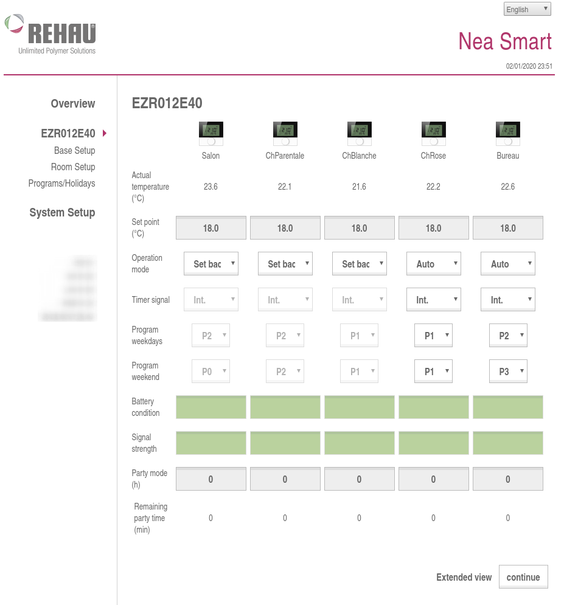
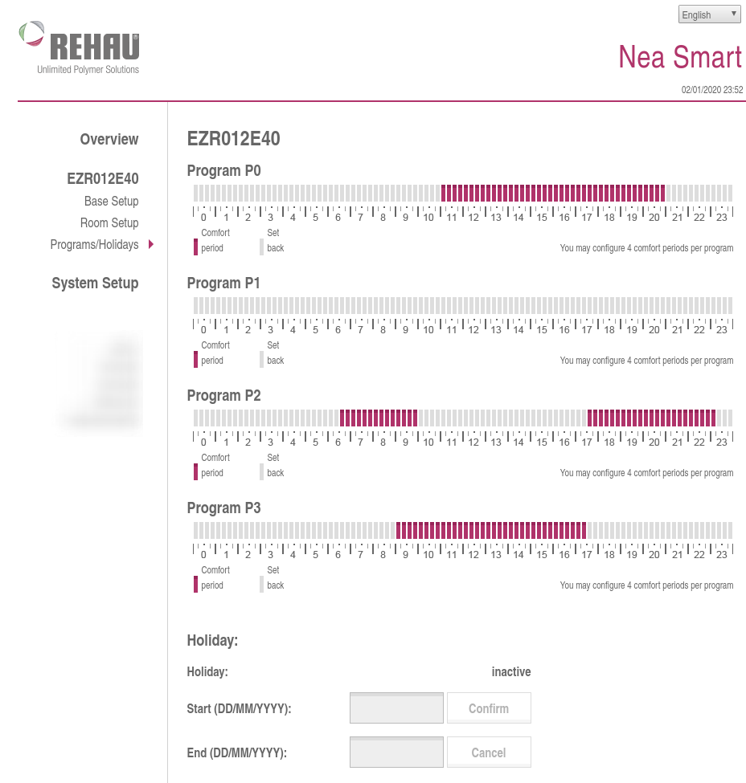

# pyrehau_neasmart

A python 3 package to interact with Rehaut Nea Smart interface

## What is Nea Smart Manager ?

If you are not familiar with the product "Nea Smart" from Rehau, this package won't be very useful for you ;).

Nea Smart Manager is an interface which allows you to control your Rehau electronic thermostat.

More informations here : https://www.rehau.com/en-en/nea-smart/english / https://www.rehau.com/download/1558632/nea-smart-manager-notice-d-installation-et-d-utilisation.pdf

Here is the interface provided by Rehau :





The problem : Nea Smart doesn't expose any public API. We need to play with the Nea Smart interface. If you check your web console, you'll see this : http://neasmart_ip/data/cyclic.xml. It's an XML file with all the information you need. If you want to do some changes, you can post an XML form to /data/changes.xml, with no authentication.

Basically, this python package is a wrapper for this weird API.

## Installation

`pip install pyrehau_neasmart`

## Changelog

See CHANGELOG.md

## To Do / Done :

- [x] Wrapper for xml documents
- [x] Get HEAT AREAS
- [ ] Get IODEVICES
- [ ] Get heatareas's schedules
- [x] Modify (POST) some informations (modify the heat area's wanted temperature)
- [ ] Logs ?
- [ ] Feel free to submit an issue ;).

## Usage

Set the right IP address, and nothig more.

By default, properties will be refreshed by querying NeaSmart only if last refresh was more than 1 second ago. Pass "auto_update=False"  to disable that behavior (in which case you'll need to call update_status() yourself).

```
from pyrehau_neasmart import RehauNeaSmart

rh = RehauNeaSmart('192.168.1.18')
# rh = RehauNeaSmart('192.168.1.18', auto_update=False)
```

### List of heatareas

```
>>> rh.heatareas()
[<pyrehau_neasmart.RehauNeaSmartHeatarea object at 0x7f634adf6860>, <pyrehau_neasmart.RehauNeaSmartHeatarea object at 0x7f634adf65f8>, <pyrehau_neasmart.RehauNeaSmartHeatarea object at 0x7f634adf6668>, <pyrehau_neasmart.RehauNeaSmartHeatarea object at 0x7f634adf66a0>, <pyrehau_neasmart.RehauNeaSmartHeatarea object at 0x7f634adf6630>]

# See below for RehauNeaSmartHeatarea object
```

### Select a heatarea and get informations

```
>>> my_heatarea = rh.heatareas()[0]

>>> my_heatarea.status
{ 'heatarea_mode': '2',
  'heatarea_name': 'ChBlanche',
  'heatarea_state': '0',
  'islocked': '0',
  'party': '0',
  'party_remainingtime': '0',
  'presence': '0',
  'program_source': '0',
  'program_week': '1',
  'program_weekend': '1',
  't_actual': '22.0',
  't_actual_ext': '22.0',
  't_target': '18.0',
  't_target_base': '18.0'}
```

Every property you'll get in status in directly callable :

```
>>> my_heatarea.t_actual
'23.4'
>>> my_heatarea.program_week
'2'
```

### Change the target temperature for a heatarea

```
>>> ha = rh.heatareas()[4]
>>> ha.set_t_target(18)
```

### Change the heat area mode for a heatarea

| HEAT AREA MDOE VALUE  | DESCRIPTION |
| ------------- | ------------- |
| 0  | AUTO mode  |
| 1  | COMFORT mode  |
| 2  | ECO mode  |


## Development

A `docker-compose.dev.yml` file is provided to easily run the package in a Docker container.

### Prerequisites

- Docker
- Docker Compose

### Run the container

```bash
docker-compose -f docker-compose.dev.yml up -d --build
```

### Enter the container

```bash
docker-compose -f docker-compose.dev.yml exec pyrehau-dev bash
```

Inside the container, the package is installed in editable mode. You can edit the code in your favorite IDE and test it inside the container.
